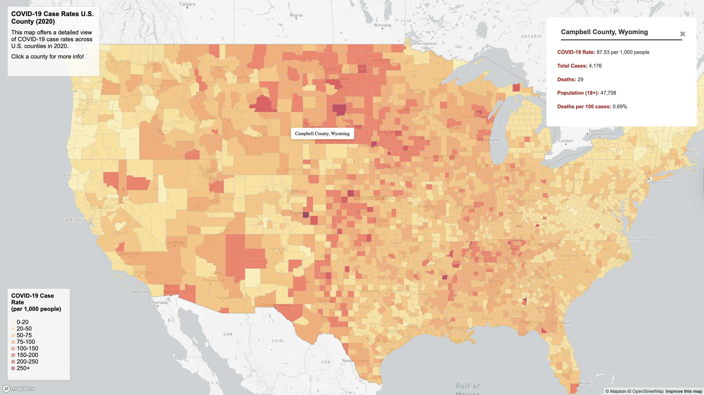

# covid19-cases-webmap
# COVID-19 in the United States (2020): Spatial Patterns and Case Distribution

## Project Overview
This project visualizes the spatial distribution of COVID-19 in the United States during 2020 using interactive web maps built with **Mapbox**. The goal is to help users explore how COVID-19 impacted different counties across the country by presenting both **case rates** and **total case counts** through two complementary map designs.

---

## Interactive Maps
- **Map 1 – COVID-19 Case Rates by County (Choropleth Map)**  
  Visualizes COVID-19 case rates per 1,000 people using graduated color bins.

- **Map 2 – Total COVID-19 Cases by County (Proportional Symbol Map)**  
  Displays total case counts using scalable circle markers.

---

## Screenshots

---

## Primary Functions
Asynchronous GeoJSON Data Fetching
This project uses an asynchronous function and the Fetch API to load external GeoJSON files.

Interactive Elements
- Hover interaction: mouse cursor hovers over counties and shows name
- Click interaction: map1 has side popup with case details, including calculated values such as deaths per 100 cases and map2 has a small popup on click showing total cases and deaths for each county.

---

## Libraries in Use
- Mapbox – Interactive web mapping for base
- JavaScript – Application and interactivity
- HTML – Page structure and layout
- CSS – Styling for maps, legends, and tooltips

## Data Sources
- **The New York Times COVID-19 County-Level Dataset (2020)**   
  https://github.com/nytimes/covid-19-data

- **U.S. County Boundary Shapefile**  
  https://www.census.gov/geographies/mapping-files/time-series/geo/carto-boundary-file.html

- **Population Data** 
  https://data.census.gov/table/ACSDP5Y2018.DP05?g=0100000US$050000&d=ACS+5-Year+Estimates+Data+Profiles&hidePreview=true

---

## Credits
- **COVID-19 Data:** The New York Times  
- **Mapping Library:** Mapbox  

---

## Acknowledgments
This project benefited greatly from publicly available open data and mapping tools that support transparent and accessible data visualization. Thank you to the organizations and developers who maintain open-source geospatial resources and documentation, which made it possible to explore and communicate complex public health data through interactive maps.
